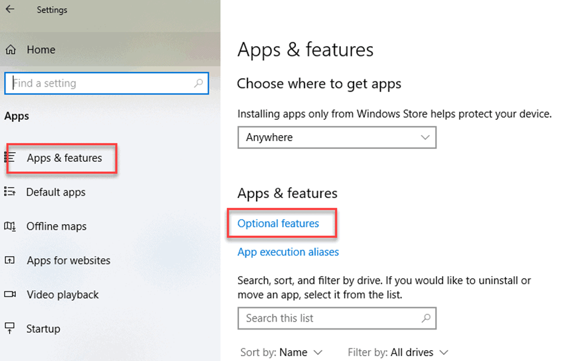
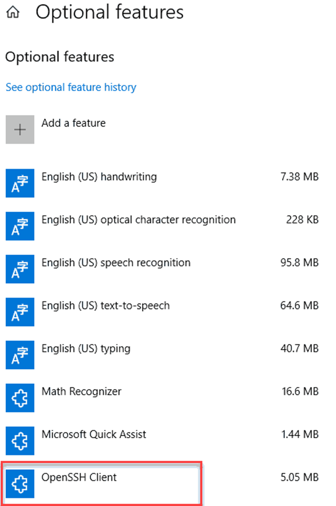
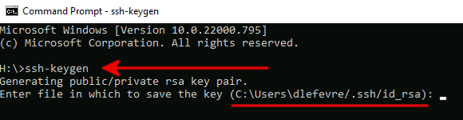
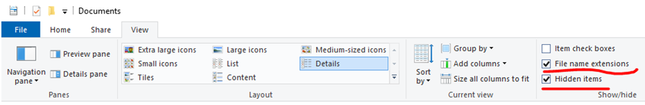
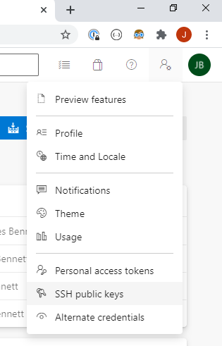
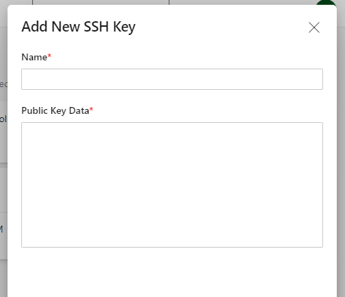

# Creating SSH Keys

Instead of using a username / password we are going to use SSH keys to authenticate with our Azure Repos
## Part 1

### Windows

Open the Windows Start menu and search for “Apps & Features”. 
In the “Apps & Features” heading, click “Optional Features”.

 
 
Scroll down the list to see if “OpenSSH Client” is listed.  If not, click the plus sign next to “Add a feature”, select OpenSSH Client, and click “Install”.
 

 
Press the Windows key or open up the Start Menu. Type “cmd”.
Under “Best Match”, click “Command Prompt”.

In the command prompt, use the ssh-keygen command:


 
By default, the system will save the keys to `[your home directory]/.ssh/id_rsa`.  

Unless you are an expert you should use the default option and press Enter.

The system will now generate the key pair and display the key fingerprint and a randomart image. These fingerprints are not needed in day-to-day use of your keys but can be saved to your notes to identify your keys later if needed.

Open your *file explorer*.  

To enable you to be able to see hidden files and folders, you need to click on the View tab, and make sure Filename extensions and Hidden items are both checked:

 

You can now navigate to the hidden “.ssh” directory in your home folder. 

You can navigate to the home folder by clicking on the `Windows (C:)` option on the left, then double-clicking the `Users` folder on the right, and finally double-clicking on the folder `firstname.lastname`. You should now open the `.ssh` folder.

### WSL & Linux-based systems

> If using WSL, Launch a WSL Session. This will Be called Ubuntu on your Start Menu

* Copy and run these in the terminal.

```bash
# generate a key (follow the prompts and dont provide a password)
# use your own BJSS email address
ssh-keygen -t rsa -C "your_email@example.com"

# Accept all the defaults and do not set a passphrase

#install as below:
sudo apt install wslu

# copy the keys to windows using this EXACT line
cp -R ~/.ssh $(wslpath $(wslvar USERPROFILE))

# this will copy the content of your public key into a clipboard (you will need this in Step 2)
cat ~/.ssh/id_rsa.pub | tee /dev/tty | clip.exe

```
---

## Part 2
Open Azure repos: https://dev.azure.com/bjss-academy/bjss-academy-students/

And add the key. You can call it what you like:




> Windows users - open your .ssh folder and open id_rsa.pub with a text editor. Copy the contents to the clipboard (Ctrl+A, Ctrl+C).

Paste your key in here that you previously copied to the clipboard in using Ctrl-V in the data field:



```
# Your key should look like this
ssh-rsa AAAAB3NzaC1yc2EAAAABJQAAAQEAv0p8sNb9AIa8rggHPr45doriKMuZ8CNHupfpsPybTPyQacgNYHaS7sq/xEeLr05qC9JXJkFWL0N42JNqmPuO8uuMLLvXU1usFysWZ2QYZQ0SdJKb/2dk0EXv7iYjr11M5HYedlCSmVWUKnyfh4/eEL3u6WGH/NsHXbgmXaViMIOVbgjt9/9ks8Aj5mSoDy/qMpznJCcGCYAOG79/M1PeF9ERACOyVo/KFN5DjzSD4n4xtFibqOZTDqZvMVsxFAOqVDKwqTIzkaR86hFsjdDVs0fk0/qWEK6liUB792Xmp3r9YVTrhvhGgcfcHsz/f68gv7/dMH7CHZU0Qu8XL8lPmw==
```
---

