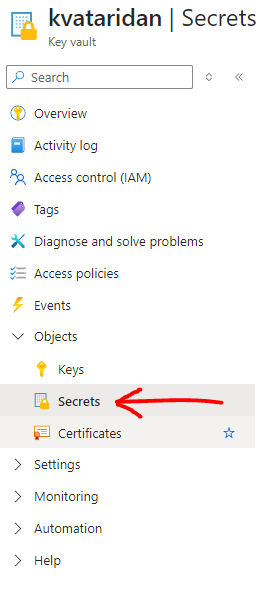

# ARM Templates Overview and Azure VM Deployment Guide

This guide is designed to help you understand the basics of ARM templates, a tool for Infrastructure as Code (IaC) in Azure, and assist you in deploying your first VM. 

## What are ARM Templates?
ARM templates are JSON files that define the infrastructure and configuration for your Azure resources. They allow you to deploy and manage Azure resources in a declarative manner, specifying what resources you need without having to write the sequence of programming commands to create them. ARM templates offer consistency, reusability, and version control for your Azure infrastructure.

## Key Concepts
1. **Declarative Syntax**
ARM templates use a declarative syntax to describe the desired state of Azure resources and their dependencies. This contrasts with imperative scripts that define the steps to achieve a desired state.

2. **Resource Definition**
Each resource in an ARM template is defined with properties such as name, type, location, and properties specific to that resource type. For example, a VM resource includes properties like virtual machine size, OS image, and network configuration.

3. **Parameters**
Parameters in ARM templates allow customization of the deployment. Users can provide input values such as VM size, username, password, and other configuration settings at deployment time. This flexibility supports deploying environments tailored to specific needs without modifying the template itself.

4. **Variables**
Variables in ARM templates enable reuse of values across the template, enhancing maintainability and readability. They are useful for storing values that are reused multiple times, such as resource names, image references, or configuration settings.

5. **Outputs**
Outputs in ARM templates provide a way to retrieve information about deployed resources after deployment completes. This can include important details like IP addresses, connection strings, or any other outputs needed for integration with other services or for monitoring purposes.

## Getting Started with ARM Templates

1. If you don't have an Azure account, sign up at [azure.microsoft.com](azure.microsoft.com).
2. Install Azure CLI from [learn.microsoft.com](https://learn.microsoft.com/en-us/cli/azure/install-azure-cli).


## Setup

1. Use Azure CLI to login.

```bash
az login --tenant [ask your tutor for tenant id] --use-device-code
```

Follow the instructions to log into your Azure account in a browser

2. Create a new directory for your ARM template files.

```bash
mkdir arm-azure-vm
cd arm-azure-vm
```

## Basic ARM Template Configuration

1. Create a file named `deployvm.json` with the following content.

```json
{
    "$schema": "https://schema.management.azure.com/schemas/2019-04-01/deploymentTemplate.json#",
    "contentVersion": "1.0.0.0",
    "parameters": {
        "team_name": {
            "type": "string",
            "metadata": {
                "description": "This is your team name"
            }
        },
        "user_id": {
            "type": "string",
            "metadata": {
                "description": "This is your user ID"
            }
        }
    },
    "functions": [
        {
            "namespace": "naming",
            "members": {
                "resource": {
                    "parameters": [
                        {
                            "name": "name",
                            "type": "string"
                        },
                        {
                            "name": "teamname",
                            "type": "string"
                        },
                        {
                            "name": "userid",
                            "type": "string"
                        }
                    ],
                    "output": {
                        "type": "string",
                        "value": "[tolower(concat(parameters('name'), '-', 'academyarm', '-', parameters('teamname'), '-', parameters('userid')))]"
                    }
                },
                "NoHypensResource": {
                    "parameters": [
                        {
                            "name": "name",
                            "type": "string"
                        },
                        {
                            "name": "teamname",
                            "type": "string"
                        },
                        {
                            "name": "userid",
                            "type": "string"
                        }
                    ],
                    "output": {
                        "type": "string",
                        "value": "[tolower(concat(parameters('name'), parameters('teamname'), parameters('userid')))]"
                    }
                },
                "group": {
                    "parameters": [
                        {
                            "name": "name",
                            "type": "string"
                        },
                        {
                            "name": "teamname",
                            "type": "string"
                        },
                        {
                            "name": "userid",
                            "type": "string"
                        }
                    ],
                    "output": {
                        "type": "string",
                        "value": "[tolower(concat(parameters('name'), '-','academyarm', '-', parameters('teamname'), '-', parameters('userid')))]"
                    }
                }
            }
        }
    ],
    "variables": {
        "tenant_id": "[subscription().tenantId]",
        "location": "uksouth",
        "ACAdmins": "b6196474-693c-4f6c-8a1a-212fd15f3369",

        "networks": {
            "vnetName": "[naming.resource('vnet', parameters('team_name'), parameters('user_id'))]",
            "vnetAddressSpace": "10.0.0.0/16",
            "subnetName": "[naming.resource('snet', parameters('team_name'), parameters('user_id'))]",
            "subnetAddressPrefix": "10.0.1.0/24",
            "public_ip_name": "[naming.resource('pip', parameters('team_name'), parameters('user_id'))]",
            "nsg_name": "[naming.resource('nsg', parameters('team_name'), parameters('user_id'))]",
            "nic_name": "[naming.resource('nic', parameters('team_name'), parameters('user_id'))]",
            "endpoints": [
                {
                    "service": "Microsoft.KeyVault"
                },
                {
                    "service": "Microsoft.Storage"
                }
            ]


        },
        "OSConfig": {
            "vmsize": "Standard_B1ls",
            "vmName": "[naming.resource('vm', parameters('team_name'), parameters('user_id'))]",
            "instances": 1,
            "OSname": "[concat(parameters('user_id'), 'vm')]",
            "OSPlan": "Default",
            "OSusername": "[parameters('user_id')]",
            "OSpassword": "[concat(uniqueString('G', parameters('user_id'), 'M' ,parameters('team_name')), 'E!')]",
            "osDiskType": "Standard_LRS",
            "OSImagePublisher": "Canonical",
            "OSImageOffer": "UbuntuServer",
            "OSImageSku": "18.04-LTS",
            "OSImageVersion": "latest",
            "nginxDownload": "https://raw.githubusercontent.com/bjssacademy/vms_and_iac_basics/ef13b5f64e91612237d40e3c471370630148ac2f/install/install_nginx.sh"
        },
        "keyVault": {
            "name": "[naming.NoHypensResource('kv', parameters('team_name'), parameters('user_id'))]",
            "sku": [
                {
                    "name": "premium",
                    "family": "A"
                }
            ]
        },
        "tags": {
            "Project": "academy2022",
            "team": "[parameters('team_name')]",
            "user": "[parameters('user_id')]",
            "mynewtag": "mynewtagvalue"
        }
    },
    "resources": [
        {
            "apiVersion": "2018-02-01",
            "type": "Microsoft.Network/networkSecurityGroups",
            "location": "[variables('location')]",
            "dependsOn": [
            ],
            "name": "[variables('networks').nsg_name]",
            "tags": "[variables('tags')]",
            "properties": {
                "securityRules": [
                    {
                        "name": "SSH",
                        "properties": {
                            "access": "Allow",
                            "description": "This NSG rule will permit connection inbound through port 22",
                            "destinationAddressPrefix": "VirtualNetwork",
                            "destinationPortRange": "22",
                            "direction": "Inbound",
                            "priority": 100,
                            "protocol": "Tcp",
                            "sourceAddressPrefix": "*",
                            "sourcePortRange": "*"
                        }
                    },
                    {
                        "name": "HTTP",
                        "properties": {
                            "access": "Allow",
                            "description": "",
                            "destinationAddressPrefix": "VirtualNetwork",
                            "destinationPortRange": "80",
                            "direction": "Inbound",
                            "priority": 110,
                            "protocol": "Tcp",
                            "sourceAddressPrefix": "*",
                            "sourcePortRange": "*"
                        }
                    }
                ]
            }
        },
        {
            "apiVersion": "2018-12-01",
            "type": "Microsoft.Network/virtualNetworks",
            "name": "[variables('networks').vnetName]",
            "location": "[variables('location')]",
            "tags": "[variables('tags')]",
            "dependsOn": [
                "[resourceId('Microsoft.Network/networkSecurityGroups', variables('networks').nsg_name)]"
            ],
            "properties": {
                "addressSpace": {
                    "addressPrefixes": [ "[variables('networks').vnetAddressSpace]" ]
                },
                "subnets": [
                    {
                        "name": "[variables('networks').subnetName]",
                        "properties": {
                            "addressPrefix": "[variables('networks').subnetAddressPrefix]",
                            "networkSecurityGroup": {
                                "id": "[resourceId('Microsoft.Network/networkSecurityGroups', variables('networks').nsg_name)]"
                            },
                            "serviceEndpoints": "[variables('networks').endpoints]"
                        }
                    }
                ]
            }
        },
        {
            "type": "Microsoft.Network/networkInterfaces",
            "apiVersion": "2020-06-01",
            "name": "[variables('networks').nic_name]",
            "location": "[variables('location')]",
            "dependsOn": [
                "[resourceId('Microsoft.Network/networkSecurityGroups/', variables('networks').nsg_name)]",
                "[resourceId('Microsoft.Network/virtualNetworks/', variables('networks').vnetName)]",
                "[resourceId('Microsoft.Network/publicIpAddresses/', variables('networks').public_ip_name)]"
            ],
            "properties": {
                "ipConfigurations": [
                    {
                        "name": "ipconfig1",
                        "properties": {
                            "subnet": {
                                "id": "[resourceid('Microsoft.Network/virtualNetworks/subnets', variables('networks').vnetName, variables('networks').subnetName)]"
                            },
                            "privateIPAllocationMethod": "Dynamic",
                            "publicIpAddress": {
                                "id": "[resourceId('Microsoft.Network/publicIPAddresses', variables('networks').public_ip_name)]"
                            }
                        }
                    }
                ],
                "networkSecurityGroup": {
                    "id": "[resourceId('Microsoft.Network/networkSecurityGroups',variables('networks').nsg_name)]"
                }
            }
        },
        {
            "type": "Microsoft.Network/publicIpAddresses",
            "apiVersion": "2020-06-01",
            "name": "[variables('networks').public_ip_name]",
            "location": "[variables('location')]",
            "dependsOn": [
            ],
            "sku": {
                "name": "Basic",
                "tier": "Regional"
            },
            "properties": {
                "publicIpAllocationMethod": "Dynamic",
                "publicIPAddressVersion": "IPv4",
                "idleTimeoutInMinutes": 4
            }
        },
        {
            "apiVersion": "2018-02-14",
            "type": "Microsoft.KeyVault/vaults",
            "name": "[variables('keyVault').name]",
            "location": "[variables('location')]",
            "tags": "[variables('tags')]",
            "dependsOn": [
                "[resourceId('Microsoft.Network/virtualNetworks', variables('networks').vnetName)]"
            ],
            "properties": {
                "tenantId": "[variables('tenant_id')]",
                "enabledForDeployment": true,
                "enabledForDiskEncryption": true,
                "enabledForTemplateDeployment": true,
                "sku": {
                    "family": "A",
                    "name": "standard"
                },
                "networkAcls": {
                    "defaultAction": "Allow",
                    "bypass": "AzureServices",
                    "virtualNetworkRules": [
                    ]
                },
                "accessPolicies": [
                    {
                        "tenantId": "[variables('tenant_id')]",
                        "objectId": "[variables('ACAdmins')]",
                        "permissions": {
                            "secrets": [ "Get", "Set", "List" ]
                        }
                    }
                ]
            }
        },
        {
            "apiVersion": "2018-02-14",
            "type": "Microsoft.KeyVault/vaults/secrets",
            "name": "[concat(variables('keyVault').name, '/OSLogin')]",
            "tags": "[variables('tags')]",
            "properties": {
                "value": "[variables('OSConfig').OSusername]"
            },
            "dependsOn": [
                "[concat('Microsoft.KeyVault/vaults/', variables('keyVault').name)]"
            ]
        },
        {
            "apiVersion": "2018-02-14",
            "type": "Microsoft.KeyVault/vaults/secrets",
            "name": "[concat(variables('keyVault').name, '/OSPassword')]",
            "tags": "[variables('tags')]",
            "properties": {
                "value": "[variables('OSConfig').OSpassword]"
            },
            "dependsOn": [
                "[concat('Microsoft.KeyVault/vaults/', variables('keyVault').name)]"
            ]
        },
        {
            "type": "Microsoft.Compute/virtualMachines",
            "apiVersion": "2020-06-01",
            "name": "[variables('OSConfig').vmName]",
            "location": "[variables('location')]",
            "tags": "[variables('tags')]",
            "dependsOn": [
                "[resourceId('Microsoft.Network/networkInterfaces/', variables('networks').nic_name)]"
            ],
            "properties": {
                "hardwareProfile": {
                    "vmSize": "[variables('OSConfig').vmsize]"
                },
                "storageProfile": {
                    "osDisk": {
                        "createOption": "fromImage",
                        "managedDisk": {
                            "storageAccountType": "[variables('OSConfig').osDiskType]"
                        }
                    },
                    "imageReference": {
                        "publisher": "[variables('OSConfig').OSImagePublisher]",
                        "offer": "[variables('OSConfig').OSImageOffer]",
                        "sku": "[variables('OSConfig').OSImageSku]",
                        "version": "[variables('OSConfig').OSImageVersion]"
                    }
                },
                "networkProfile": {
                    "networkInterfaces": [
                        {
                            "id": "[resourceId('Microsoft.Network/networkInterfaces', variables('networks').nic_name)]"
                        }
                    ]
                },
                "osProfile": {
                    "computerName": "[variables('OSConfig').OSname]",
                    "adminUsername": "[variables('OSConfig').OSusername]",
                    "adminPassword": "[variables('OSConfig').OSpassword]",
                    "linuxConfiguration": {
                        "disablePasswordAuthentication": false
                    }

                }
            },
            "resources": [
                {
                    "apiVersion": "2019-07-01",
                    "type": "Microsoft.Compute/virtualMachines/extensions",
                    "name": "[concat(variables('OSConfig').vmName, '/Setup')]",
                    "location": "[variables('location')]",
                    "dependsOn": [
                        "[concat('Microsoft.Compute/virtualMachines/', variables('OSConfig').vmName)]"
                    ],
                    "properties": {
                        "publisher": "Microsoft.Azure.Extensions",
                        "type": "CustomScript",
                        "typeHandlerVersion": "2.1",
                        "autoUpgradeMinorVersion": true,
                        "settings": {
                        },
                        "protectedSettings": {
                            "fileUris": [
                                "[variables('OSConfig').nginxDownload]"
                            ],
                            "commandToExecute": "./install_nginx.sh"
                        }
                    }
                }
            ]
        }
    ],
    "outputs": {
    }
}

```

2. Create a file named `deployvm.parameters.json` with the following content.

```json
{
    "$schema": "https://schema.management.azure.com/schemas/2019-04-01/deploymentParameters.json#",
    "contentVersion": "1.0.0.0",
    "parameters": {
        "team_name": {
            "value": "team_name"
        },
        "user_id": {
            "value": "user_name"
        }
    }
}

```

## Deploy the Template

1. Before deploying the template, create a resource group.

:exclamation: remember to replace $teamName and $userId with your team name and username!

```bash
az group create --name rg-academyarm-$teamName-$userId --location uksouth

# Example
# az group create --name rg-academyarm-atari-dan --location uksouth
```

Following the successful creation of your resource group we are now going to a validate our template with Azure.

To do this, run the following command:

```bash
az deployment group validate --resource-group rg-academyarm-$teamName-$userId \
--template-file deployvm.json \
--query properties.outputs.azurerm_public_ip \
--parameters team_name="$teamName" user_id="$userId"
```

If the command doesn't return an error, then Azure has found no issue with our template. _Good news!_

2. Use the Azure CLI to deploy the ARM template.

Let's now run a 'what-if' scenario to Azure to see what changes we will be making to that newly built resource group. Run the following command to do this:

_Hint: To run the deployment without doing a 'what-if', you just remove the `-c` option._

```bash
az deployment group create -c --resource-group rg-academyarm-$teamName-$userId   --template-file deployvm.json --query properties.outputs.azurerm_public_ip --parameters team_name="$teamName" user_id="$userId"

# example
# az deployment group create -c --resource-group rg-academyarm-atari-dan --template-file deployvm.json --query properties.outputs.azurerm_public_ip --parameters team_name="atari" user_id="dan"

```

To break the command down:
* We are firstly telling Azure we want to do a deployment into an Azure Resource Group.
* We specify that we want to create a deployment and we provide the `-c` option to the command which sets it to `what-if`
* This command is the 'what-if' syntax that will tell Azure we want to see what changes will happen prior to us doing the deployment.

Example - The deployment will update the following scope:

```
Scope: /subscriptions/993d9215-8911-4938-8121-9608c3ac1fd5/resourceGroups/rg-academyarm-yourteamname-youruserid

  + Microsoft.Compute/virtualMachines/vm-academyarm-yourteamname-youruserid [2020-06-01]

      apiVersion:                                                            "2020-06-01"
      id:                                                                    "/subscriptions/993d9215-8911-4938-8121-9608c3ac1fd5/resourceGroups/rg-academyarm-yourteamname-youruserid/providers/Microsoft.Compute/virtualMachines/vm-academyarm-yourteamname-youruserid"
      location:                                                              "uksouth"
      name:                                                                  "vm-academyarm-yourteamname-youruserid"
      properties.hardwareProfile.vmSize:                                     "Standard_B1ls"
      properties.networkProfile.networkInterfaces: [
        0:

          id: "/subscriptions/993d9215-8911-4938-8121-9608c3ac1fd5/resourceGroups/rg-academyarm-yourteamname-youruserid/providers/Microsoft.Network/networkInterfaces/nic-academyarm-yourteamname-youruserid"

      ]
```

Once Azure has given you the rundown on what its going to change and implement it will ask if you want to deploy: 

```
Are you sure you want to execute the deployment? (y/n):
```

Have a look through the scenario and if your happy with the infrastructure we are going to be building enter `Y`

---
If during the `az deployment`, you receive an error message similar to:
```
unable to locate package nginx
```
... unfortunately this is a known issue that happens for a select few students, occurring randomly with no obvious root cause. If this happens, please remove the Azure Resource Group that contains the VM and try the run again.

---

# Looking in the Portal
We can look at the resources created in the portal (look for the resource group that matches your team and name): https://portal.azure.com/?quickstart=True#blade/HubsExtension/BrowseResourceGroups

Once you have navigate to the Resource Group you should be able to see a 'Deployments' option and a status that is next to that.

Hopefully saying 'Deploying' or 'Succesful'

## Querying the Key Vault
Within this ARM template we generate a password using a unique string and then stash that password inside an Azure [Key Vault](https://azure.microsoft.com/en-gb/services/key-vault/). We can't navigate to our site just yet, as we haven't enabled the secrets access policy, so let's do that now.

Following the deployment of your ARM templates you can now navigate to your newly created Key Vault.

To find the Key Vaults section in the Azure portal, use the Search Bar (very top and centre on any page in the Azure portal) to search for **Key Vaults**. You can also find it from the _All services_ menu, then _Security_, then finally _Key Vaults_.

When you open the Key Vault you will be presented with a list of different options on the left pane.

One of these options is the _Access Policies_ pane. Click into that when you see it.

Once in that panel, click on the '+ Create' button (located at the top of the right-hand side Key Vault pane).

You'll see a selection of check boxes. Under the _Secret permissions_ column, select 'Get, List, Set'. No others should be selected here. Then select the _Next_ button at the bottom of the page.

On the next tab, _Principal_, you'll need to add yourself as the principal. Enter _your whole BJSS email address_ to find your user account, then select it. Note that typing your name here, or entering partial search terms _will not work_ - it must be your _whole email address_ typed or pasted in - otherwise, it will not find you. Then select the _Next_ button at the bottom of the page.

> NOTE: if you can't find it by email run the command:
> ```
> az ad signed-in-user show --query 'id'
> ```
> and use the id to try and find yourself as principal.

The next tabs are optional - select the _Next_ button at the bottom of the page on each, then finally the _Create_ button.

## Accessing your VM
You'll need to run the following command to obtain your VMs public IP:

```bash
az network public-ip list -g rg-academyarm-$teamName-$userId --query [].ipAddress -otsv
```

We can access our VM using the public IP Address. In a browser navigate the IP address output by your deployment: `http://\<your vm public ip address>`

You should see the Nginx Welcome Page!

---

## Getting your secrets

Once you have created an access policy you should now be able to go to the 'Secrets' panel in the Azure Portal.



Inside of there you will see two secrets:

* `OSlogin`
* `OSPassword`

Select the `OSPassword` secret. Once there, it'll display all of the versions of that secret. As this is freshly created, there will only be one version (with a random value underneath the _CURRENT VERSION_ heading), so select it to take you to the details of the secret you have selected.

Once you have the details page, use the copy link next to the secret value to copy the current value of the `OSPassword` secret, as we will need this for the following steps.

---

## Making a Change In ARM
Because we have now entered a Key Vault policy that isn't our ARM deployment when we rerun the ARM code we are going to remove our own access.\
So to mitigate this we are going to now add your user to the ARM templates access policy.

Firstly we will need to run an Azure CLI command to get your user's `objectId`:

_nb_: Output changed from `objectId` to `id` in newer `az` tool releases. Make sure the tool is up to date if the following command doesn't give a UUID in the output:

```bash
az ad signed-in-user show --query 'id' -otsv
```

Now we will use VS Code to make changes to the access policy with the objectId we have.
If you aren't using VS Code, substitute `code` with your editor in the guide below:

Run `code deployvm.json` to open up your file, then find 'accessPolicies' in the file. This should present you with something like is shown below:

```json
"bypass": "AzureServices",
"virtualNetworkRules": [
            ]
        },
        "accessPolicies": [
            {
                "tenantId": "[variables('tenant_id')]",
                "objectId": "[variables('ACAdmins')]",
                "permissions": {
                    "secrets": [ "Get", "Set", "List" ]
                }
            }
        ]
```

Now we want to enter the new access policy rule.

Modify the above to look like the following example. Don't forget to also substitute `<the-id-copied-from-the-az-ad-command-you-ran-earlier>` with the value from the `az ad` command you ran earlier.

```json
"bypass": "AzureServices",
"virtualNetworkRules": [
            ]
        },
        "accessPolicies": [
            {
                "tenantId": "[variables('tenant_id')]",
                "objectId": "[variables('ACAdmins')]",
                "permissions": {
                    "secrets": [ "Get", "Set", "List" ]
                }
            },
            {
                "tenantId": "[variables('tenant_id')]",
                "objectId": "<the-id-copied-from-the-az-ad-command-you-ran-earlier>",
                "permissions": {
                    "secrets": [ "Get", "Set", "List" ]
                }
            }
        ]
```
_Don't forget to save your changes!_

Now we have made a change to the tags on the resource group. Using the whole command we used for `az deployment group create...` earlier, run the command again - if you set the default variables in the above steps you can run the same command again verbatim, excluding the `-c` flag as we don't need to 'what-if' it. 

You should see that ARM wants to do an in-place update and add the new Tag to the resource.

```bash
Example Output:
    ~ properties.accessPolicies: [
      + 1:

          objectId:     "4ebcd214-68c4-4efe-8886-6a260ad766db"
          permissions.secrets: [
            0: "Get"
            1: "Set"
            2: "List"
          ]
          tenantId:     "4xxd214-xxx-4xxe-8886-6xx60axx6db"
```

It will prompt to continue:
```
Are you sure you want to execute the deployment? (y/n):
```
Have a look through the scenario and if your happy enter `Y`

You can check the new Access policy appears in the Azure portal by viewing your Key Vault.

## Destroying Our Infrastructure
To remove our infrastructure we will now be deleting it by doing the following

````bash
# As with all delete commands, With great power there must also come great responsibility.
# Always triple check when deleting a resourceGroup!
# Are you sure you want to perform this operation? (y/n):
az group delete --name rg-academyarm-$teamName-$userId 

# example
# az group delete --name rg-academyarm-atari-dan
````

